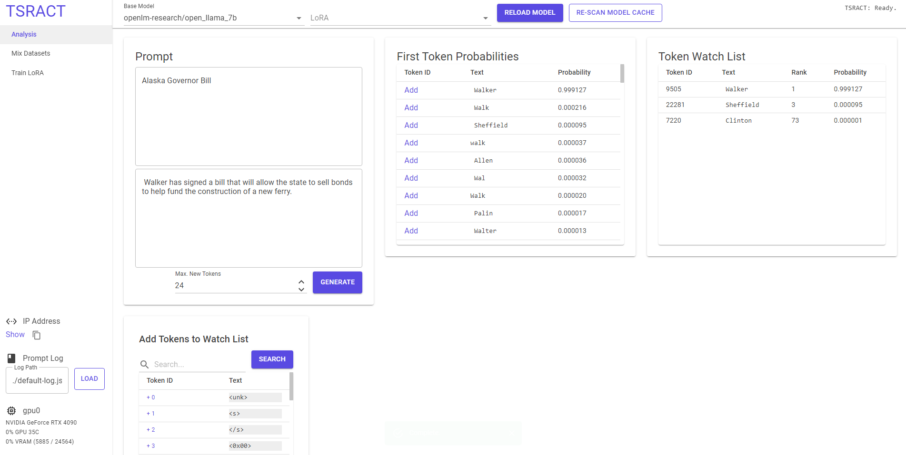
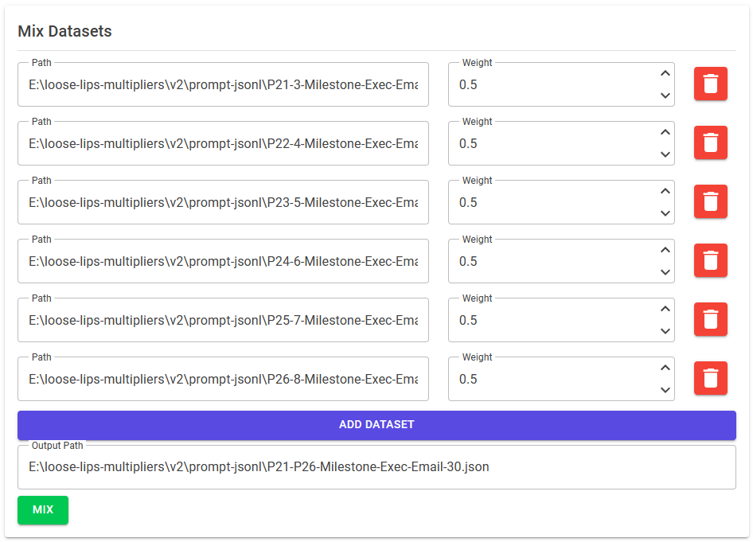
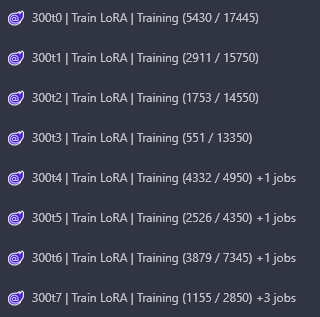
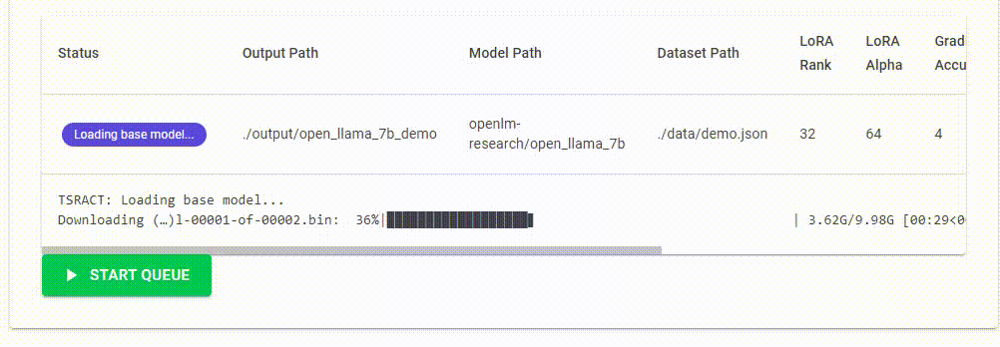

# TSRACT: .NET Language Model LoRA Training & Inference Tool

TSRACT is an open-source tool that allows you to train language model LoRAs and run inference on a local GPU. It is designed to be run and accessed locally on a single machine. You can deploy this to cloud GPU services such as RunPod and access it remotely.

<p align="center" width="100%">

</p>

## Features:

### Analysis
- Switch between models/LoRAs without leaving prompting view
- See token probabilities for the first token of every response
- Simple .json prompt logging
- Token "watch" functionality - see the sorted list position and probability of tokens you are interested in

### Dataset Mixer
- Mix datasets (currently supports .json files containing an array of objects)

<p align="center" width="100%">

</p>

### Training
- Train 4-bit LoRA on LLaMA-based models
- Queue multiple LoRA trainings back-to-back
- Custom node name and progress output in tab title

<p align="center" width="100%">


</p>

## 🚀 Getting Started

### On Windows
TSRACT Windows compatibility is shaky at this time. Still sorting out CUDA/bitsandbytes-related issues. My goal is to have this work as a one-click setup on both Windows and Linux.

### On Runpod
Start a new pod using the `RunPod Pytorch 2.0.1` template, be sure to include 40-50GB of storage and open ports `8888,5000`. `8888` will be for the JupyterLab console and `5000` will be for TSRACT.

```
apt-get update && apt-get install -y dotnet-sdk-7.0
git clone https://github.com/TSRACT-AI/TSRACT.git && cd TSRACT
chmod +x ./start-linux-baremetal.sh
./start-linux-baremetal.sh
```

From the RunPod Connect dialog, click the button to connect on port 5000.

You should pre-download models as the auto-downloader does not currently report progress to the TSRACT UI. Working on it! You can run `python download-base-model.py` to download `openlm-research/open_llama_7b` to get started.

ℹ️ Note: If you will be training LoRAs, you must do `pip install wandb && wandb login` and enter your API key, if you are only running inference you can skip this step.

## ℹ️ Notes
- This is an early release version of TSRACT. Things are a bit messy and will be cleaned up before many new features are added.
- The near-term vision is to add peer-to-peer connectivity or a hub-and-spoke system to connect TSRACT nodes together. You will be able to queue up multiple LoRA training jobs and distribute them to other nodes.
- Although the user interface is presented in a web browser, this software is designed to be used by a single user or run unattended while running a training queue. TSRACT will not be stable with multiple users connecting to the same instance.
- The default behavior is to listen on localhost only, since there is no authentication by default. On RunPod, the startup script passes the `--listen-all-bindings=true` command line argument to bypass the localhost restriction. Be careful not to show anyone your RunPod Pod ID as they will be able to determine the RunPod access URL for your instance.
